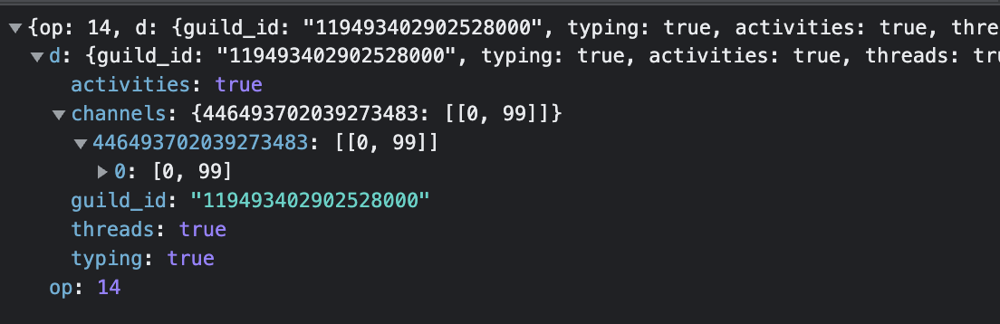
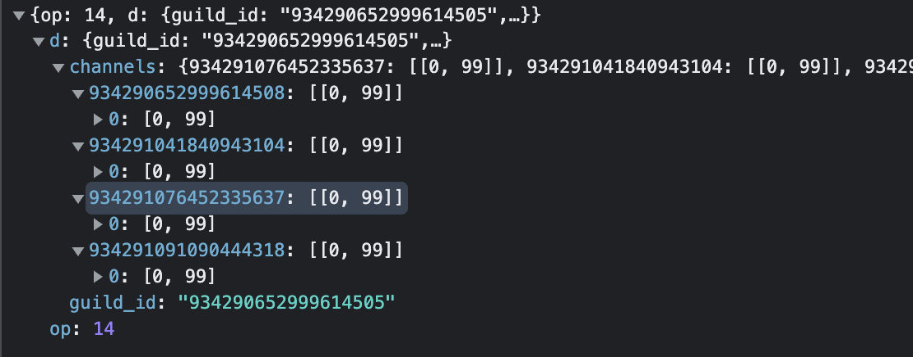
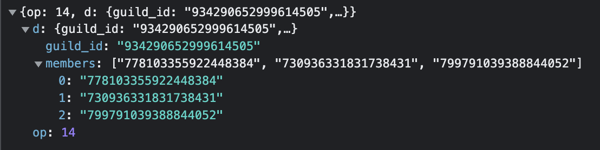
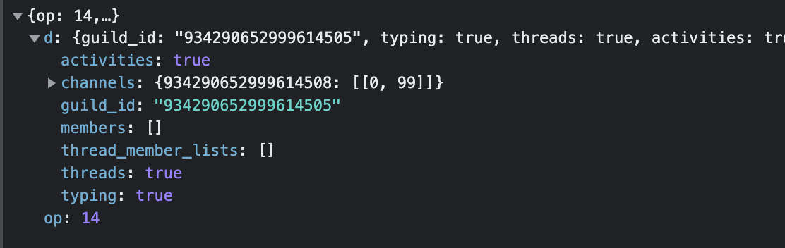

# Gateway OpCodes

### Sequence Numbers

When recieving data, if you recieve an [Opcode 0 Dispatch Event](#_0-dispatch-event), you will get an `s` value, or a `Sequence Number`. Store this number somewhere and update it every time you get a new one.

NOTE: Any event except the [Opcode 0 Dispatch Event](#_0-dispatch-event) will give an `s` value of `null`, DO NOT store this.

NOTE: When you recieve an [Opcode 10 Hello](#_10-hello), you should set the stored `Sequence Number` to 0.

> IMPORTANT: You DO NOT need to change the `Sequence Number` at all by yourself, only set it to the value you recieve.

Whenever you send data to Gateway (excluding [Opcode 2 Identify](#_2-identify)), you should put the `Sequence Number` you have stored into wherever it tells you to.

## Recieving

### 0 Dispatch Event

Recieved whenever Gateway is sending you an event.

```Opcode 0
{
    "op": 0,
    "d" (Event Data): {},
    "s": `Sequence Number`,
    "t": "Event Name"
}
```

### 1 Request Heartbeat

The Gateway may occasionally send an Opcode 1 when it wants the client to send a heartbeat.

The client should immediately heartbeat no matter the `heartbeat_interval`.

```Opcode 1
{
    "op": 1
}
```

### 7 Reconnect And Resume

The Gateway may send this during updates or backend work, when recieved, the client should immediately destroy the connection and start a new one, after creating the new one, it should run an [Opcode 6 Resume](#_6-resume).

```Opcode 7
{
    "op": 7
}
```

### 9 Invalid Session

Recieved in an invalid session, which can be caused by:

-   Being in one session too long
-   Having an invalid token
-   Failing to heartbeat in time
-   etc..

NOTE: The Opcode 9 `d` value is whether you should resume the connection using an [Opcode 6 Resume](#_6-resume) or start a new connection and use an [Opcode 2 Identify](#_2-identify).

```Opcode 9
{
    "op": 9,
    "d" (Whether to resume connection): true | false
}
```

### 10 Hello

Recieved on successful connection to Gateway.

```Opcode 10
{
    "op": 10,
    "d": {
        "heartbeat_interval": number (ms)
    }
}
```

### 11 Heartbeat Acknowledge

Sent to Acknowledge a heartbeat.

NOTE: If Gateway fails to respond with an [Opcode 11 Heartbeat Acknowledge](#_11-heartbeat-acknowledge) after about 10 seconds, you should destroy the connection and make a new one.

```Opcode 11
{
    "op": 11
}
```

## Sending

### 1 Heartbeat

Sent as a heartbeat mechanism for Gateway to verify that you are still on the connection.

```Opcode 1
{
    "op": 1,
    "d" `Sequence Number`
}
```

NOTE: Should always be responded to with an [Opcode 11 Heartbeat Acknowledge](#_11-heartbeat-acknowledge). If Gateway fails to respond with an [Opcode 11 Heartbeat Acknowledge](#_11-heartbeat-acknowledge) after about 10 seconds, you should destroy the connection and make a new one.

### 2 Identify

Sent to identify as a user in Gateway.

```Opcode 2
{
    "op": 2,
    "d": {
			"token": "User Token",
			"capabilities": 509,
			"compress": false,
			"client_state": {
				"guild_hashes": {},
				"highest_last_message_id": "0",
				"read_state_version": 0,
				"user_guild_settings_version": -1,
				"user_settings_version": -1
			},
			"properties": {
				"os":
                    - iOS
                    - Mac OS X
                    - Others (Unkown)
				"browser":
                    - "Discord Desktop" (For Default Status Indicator)
                    - "Discord Android" (For Mobile Status Indicator)
				"release_channel": "stable",
				"system_locale": "en-US"
			},
			"presence": {
				"activities": Array<Activity (Look Below)>,
				"afk": true | false,
				"since" (Been In This Status Since): 0,
				"status":
                    - "online"
                    - "invisible"
                    - "offline"
                    - "dnd"
                    - "idle"
			}
		}
}
```

[Activity Type](/Data-Types#activity)

### 3 Presence Update

Sent to update the presence of the user.

Ex:

-   Online | Invisible | Offline | Idle | DnD
-   Typing | Not Typing
-   New Activity
-   etc...

[Info From Official Docs](https://discord.com/developers/docs/topics/opcodes-and-status-codes#:~:text=and%20Status%20Codes-,Gateway,-All%20gateway%20events)

### 4 Voice State Update

Sent to update the voice state of the user.

Ex:

-   Muted
-   Deafened
-   Camera Enabled/Disabled
-   etc...

[Info From Official Docs](https://discord.com/developers/docs/topics/opcodes-and-status-codes#:~:text=and%20Status%20Codes-,Gateway,-All%20gateway%20events)

### 6 Resume

Resume a connection that got disconnected.

NOTE: Requires a `token` (From Logging In), `session_id` (From READY Event), and `Sequence Number`.

NOTE: To resume a connection, you must first destroy the original connection, then create a new one using the [Connecting Guide](/Gateway/Connecting.md).

> <h4><b>IMPORTANT:</b></h4> When creating a new connection for the Opcode 6, you must use the <code>resume_gateway_url</code> that you recieved from the READY event.

```Opcode 6
{
    "op": 6,
    "d": {
        "token": "TOKEN",
        "session_id": "SESSION ID",
        "seq": "SEQUENCE NUMBER"
    }
}
```

### 8 Request Guild Members

[Info From Official Docs](https://discord.com/developers/docs/topics/opcodes-and-status-codes#:~:text=and%20Status%20Codes-,Gateway,-All%20gateway%20events)

### 14 (VERY LITTLE KNOWN)

Fetch Guild Members/Channels

!> VERY LITTLE KNOWN

Screenshots:





